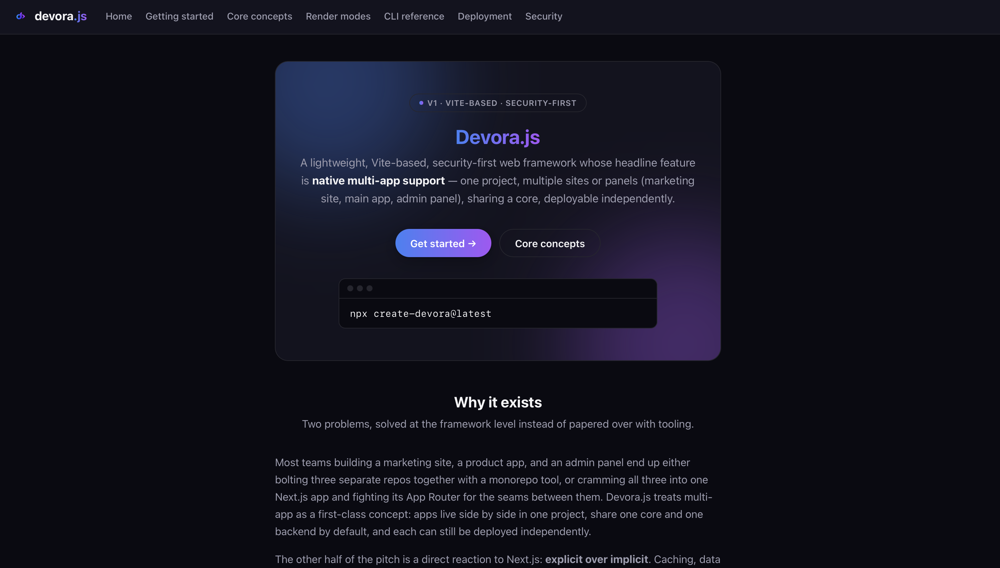

<div align="center">

  

  # Devora.js Documentation

  **Official documentation and guides for [Devora.js](https://github.com/hassanalsa3aka/devora.js)**  
  *A lightweight, Vite-based, security-first web framework with native multi-app support.*

  <p>
    <a href="https://github.com/hassanalsa3aka/devorajs-docs/blob/main/LICENSE"></a>
    = 20" />
    
    
    
  </p>

  <p>
    <a href="#-quick-start">Quick Start</a> •
    <a href="#-key-features">Key Features</a> •
    <a href="#-project-structure">Project Structure</a> •
    <a href="#-render-modes">Render Modes</a> •
    <a href="#-deployment">Deployment</a>
  </p>

  <br />

  

</div>

---

## 🌟 Overview

**Devora.js** is a modern web framework built on Vite that treats multi-app development as a first-class concept. Instead of managing complex monorepo configurations or forcing separate marketing, product, and admin sites into a single overloaded router, Devora.js allows multiple applications to live side-by-side in one project—sharing a unified core and backend while deploying completely independently.

This repository contains the official documentation portal built with Devora.js itself using Static Site Generation (`ssg`) and interactive islands.

---

## 🚀 Key Features

- 🏢 **Native Multi-App Support**  
  Manage your marketing site, main app, and admin portal in one unified repository with isolated routing, shared packages, and independent deployments.
- 🎯 **Explicit Over Implicit**  
  Render modes, data loaders, and server/client boundaries are explicitly declared right in your route files. No hidden background caches or magic conventions.
- 🛡️ **Security by Default**  
  Pre-configured Content Security Policy (CSP), HSTS headers, CSRF protections, and cryptographically signed sessions out of the box.
- ⚡ **Flexible Render Modes (SSR, SSG, CSR, ISR)**  
  Choose the exact rendering strategy on a per-route basis to maximize performance and SEO.
- 🏝️ **Selective Island Hydration**  
  Hydrate only the interactive components that need JavaScript while keeping the surrounding page zero-cost static HTML.
- 🔌 **Bring Your Own Backend (BYOB)**  
  Integrate any database, ORM, or auth provider with shared server functions and type-safe utilities.

---

## 📁 Project Structure

```text
devorajs-docs/
├── apps/
│   └── docs/                  # Official documentation app
│       ├── routes/            # Documentation routes (SSG / SSR / CSR)
│       │   ├── index.tsx          # Docs landing page
│       │   ├── getting-started.tsx# Quick start & installation guide
│       │   ├── core-concepts.tsx  # Multi-app, explicit routing, & islands
│       │   ├── render-modes.tsx   # SSR, SSG, CSR, and ISR in-depth
│       │   ├── cli-reference.tsx  # Devora CLI command guide
│       │   ├── deployment.tsx     # Cloud & container deployment guides
│       │   └── security.tsx       # Built-in security architecture
│       ├── nav.ts             # Documentation navigation structure
│       ├── netlify.toml       # Netlify deployment configuration
│       └── vercel.json        # Vercel deployment configuration
├── assets/
│   ├── icons/                 # Brand logos and badges
│   └── screenshots/           # Application screenshots and previews
├── packages/
│   └── backend/               # Shared backend utilities & server logic
├── devora.config.ts           # Root Devora multi-app project configuration
├── package.json               # Root workspace scripts & dependencies
└── tsconfig.base.json         # Base TypeScript configuration
```

---

## 🛠️ Quick Start

### Prerequisites

- **Node.js**: `v20.0.0` or higher
- **npm** / **pnpm** / **yarn**

### Installation

Clone the repository and install dependencies:

```bash
git clone https://github.com/hassanalsa3aka/devorajs-docs.git
cd devorajs-docs
npm install
```

### Development

Start the local development server with Hot Module Replacement (HMR):

```bash
npm run dev
```

The documentation app will be available at `http://localhost:3000` (or the port specified by the Devora CLI).

### Building for Production

Compile and optimize all apps for production:

```bash
npm run build
```

### Preview / Production Run

Start the production server:

```bash
npm run start
```

---

## ⚙️ Configuration (`devora.config.ts`)

Devora projects define all sub-applications and shared workspaces in `devora.config.ts`:

```typescript
import { defineProject } from "@devorajs/core/config";

export default defineProject({
  apps: [
    {
      name: "docs",
      dir: "apps/docs",
      domain: "docs.example.com",
      auth: "none",
    },
  ],
  shared: {
    core: "packages/core",
    backend: "packages/backend",
    auth: "shared",
  },
});
```

---

## 🔄 Render Modes

Devora supports 4 explicit render modes declared per route:

| Mode | Identifier | Description | Best For |
| :--- | :--- | :--- | :--- |
| **SSG** | `export const renderMode = "ssg"` | Static Site Generation at build time | Documentation, landing pages, marketing blogs |
| **SSR** | `export const renderMode = "ssr"` | Server-Side Rendering on each incoming request | Dynamic user dashboards, personalized feeds |
| **CSR** | `export const renderMode = "csr"` | Client-Side Rendering with SPA behavior | Offline tools, internal dashboards, portals |
| **ISR** | `export const renderMode = "isr"` | Incremental Static Regeneration with revalidation | High-traffic content sites, e-commerce listings |

---

## 🚢 Deployment

The documentation app can be deployed independently to your hosting platform of choice:

- **Vercel**: Pre-configured with [`vercel.json`](apps/docs/vercel.json)
- **Netlify**: Pre-configured with [`netlify.toml`](apps/docs/netlify.toml)
- **Node / Docker**: Containerize with standard Node.js v20 runtime.

---

## 📄 License

This project is licensed under the [MIT License](LICENSE).

---

<div align="center">
  <sub>Built with ❤️ for the <a href="https://github.com/hassanalsa3aka/devora.js">Devora.js</a> ecosystem.</sub>
</div>
